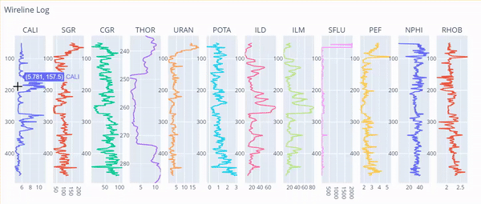

# Learn How to Plot Wireline and Drilling Logs in Python

## Introduction
In this repository, you will find Python code to plot oil and gas well wireline and petrophysical logs using Plotly and Matplotlin. Plots in drilling industry is different than what we usually see. The Y Axis is reversed to depict data traverse along the depth of the well.

## Dependencies
To run the code in this repository, you will need the following Python packages:
- Pandas
- NumPy
- Matplotlib
- Plotly

## Usage
You can use the notebook which has step by step detail.
For explanation here is the link to article: https://medium.com/@sarmadafzalj/python-plotting-wireline-oil-gas-well-logs-8fb3fcdc4c0c

## Reach out to me
- <i>Author: <b>Sarmad Afzal</b></i>
- <i>Linkedin: https://www.linkedin.com/in/sarmadafzal/</i>
- <i>Github: https://github.com/sarmadafzalj</i>
- <i>Youtube: https://www.youtube.com/@sarmadafzalj</i>
- <i>Medium Blog: https://medium.com/@sarmadafzalj</i>
---