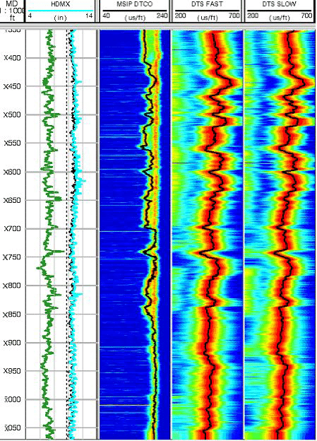

# Predicting Sonic Logs DT using Previous Wells Wireline Logs

## Overview
This Python script demonstrates how can you use previous wells wireline logs data and train on it to predict the Sonic logs (DT) in the new wells where you have other logs like resistivity, neutron density, porosity and GR but not DT.

## Why would you want to predict Sonic DT
Predicting sonic logs using AI/ML offers a safer, more efficient alternative to traditional methods, which often involve the risky deployment of fragile tools in complex well conditions. By simulating sonic logs through advanced modeling, you can minimize equipment damage, reduce operational costs, and make faster decisions, all while achieving the same objectives without physically inserting tools into the well.

## Data Source
The script utilizes well log data for Volvo Field downloaded from open data in Equinor website, converted from LAS to CSV format.
link: https://www.equinor.com/how-and-why/digitalisation-in-our-dna/volve-field-data-village-download
We are going to use data for well 15/9-F-11A as our training set and well 15_9-F-1A as test dataset.

## Reach out to me
- <i>Author: <b>Sarmad Afzal</b></i>
- <i>Linkedin: https://www.linkedin.com/in/sarmadafzal/</i>
- <i>Github: https://github.com/sarmadafzalj</i>
- <i>Youtube: https://www.youtube.com/@sarmadafzalj</i>
- <i>Medium Blog: https://medium.com/@sarmadafzalj</i>
---