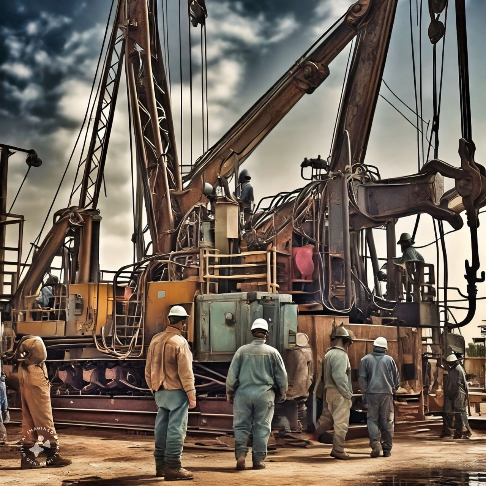

# Data Science in Oil and Gas Industry
You will find several interesting Data Science projects in the field of Oil and Gas Industry. From EDA and plotting well profiles to running predictive machine learning models

## Here's a list of links to all projects
- <a href="https://github.com/sarmadafzalj/Data-Science-in-Oil-and-Gas-Industry/tree/main/Plotting%20Washouts%20and%20Undergauge%20Well%20Borehole%20from%20a%20Petro%20Wireline%20Log%20" >Plotting Washouts and Undergauge Well Borehole from a Petro Wireline Log</a>
- <a href="https://github.com/sarmadafzalj/Data-Science-in-Oil-and-Gas-Industry/tree/main/Plotting%20Drilling%20and%20Wireline%20Logs%20in%20Python" >Plotting Wireline and Petrophysical logs using Plotly in Python</a>
- <a href="https://github.com/sarmadafzalj/Data-Science-in-Oil-and-Gas-Industry/tree/main/Plotting%20Well%20Borehole%20in%203D" >Plotting a 3D well borehole profile using Plotly in Python</a>

## Reach out to me
- <i>Author: <b>Sarmad Afzal</b></i>
- <i>Linkedin: https://www.linkedin.com/in/sarmadafzal/</i>
- <i>Github: https://github.com/sarmadafzalj</i>
- <i>Youtube: https://www.youtube.com/@sarmadafzalj</i>
- <i>Medium Blog: https://medium.com/@sarmadafzalj</i>
---
